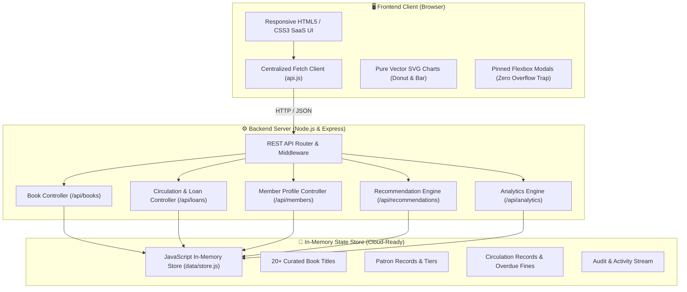
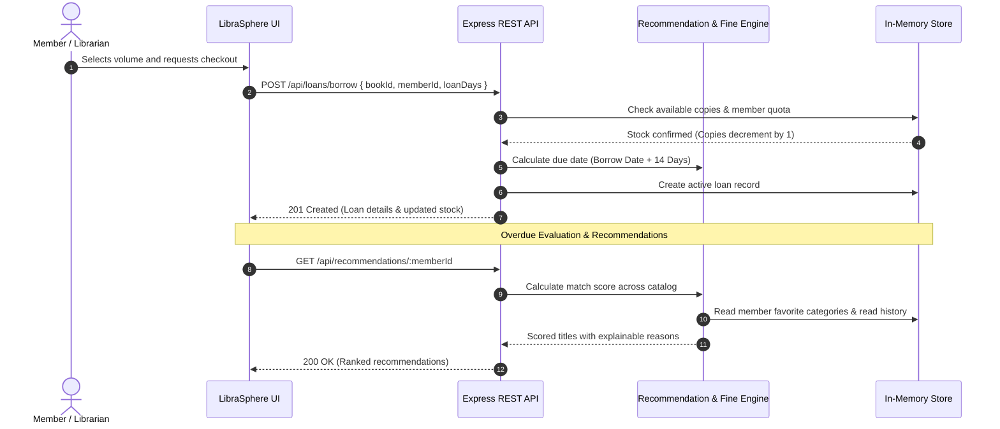

# 📚 LibraSphere
### Smart Library Management & Discovery System
> **Tagline:** *Discover. Borrow. Track. Read.*  
> **Course / Track:** Cloud Computing — Project 7  
> **Architecture:** Cloud-Ready Stateless Client-Server with In-Memory State

---

## 🌟 Executive Summary

**LibraSphere** is a modern, cloud-ready library management and reading discovery platform. While traditional library systems focus narrowly on basic CRUD operations, LibraSphere pairs core circulation workflows (checkouts, returns, automated due dates, dynamic overdue fines) with an intelligent discovery experience (transparent rule-based book recommendations, patron reading profiles, printable dossiers, and vector SVG analytics).

---

## ☁️ Cloud Architecture & Viva Justification

> [!NOTE]
> **Cloud-Ready vs. Cloud-Hosted Explanation:**  
> LibraSphere does **not** claim to be deployed on an external cloud provider. Instead, it implements a **cloud-ready client-server architecture**. The browser communicates strictly with centralized Node.js REST services using HTTP/JSON via the Fetch API. The application state is maintained in-memory for this micro-project, meaning the backend can be containerized (Docker) and deployed to any cloud platform (AWS ECS, Google Cloud Run, Azure App Service) with the storage layer swapped for a managed cloud database (MongoDB Atlas, AWS DynamoDB, PostgreSQL) **without rewriting any frontend client code**.

---

## 🏛️ System Architecture



---

## 🔄 Circulation & Recommendation Flow



---

## 🎯 Transparent Recommendation Algorithm

LibraSphere rejects opaque or fake "AI/ML" buzzwords in favor of an **explainable, deterministic rule-based formula**:

$$\text{Score} = (\text{Category Match} \times 5) + (\text{Author Match} \times 4) + (\text{Tag Match} \times 2) + (\text{Rating} \times 1.5) + \text{Availability Bonus (3)}$$

- **Category Match (+5 pts):** Volume category matches member's recorded preferences or previous borrowing categories.
- **Author Match (+4 pts):** Author matches previously enjoyed works by the patron.
- **Tag Match (+2 pts each, max 6 pts):** Overlapping topical keywords (e.g., *Distributed Systems*, *Microservices*).
- **Critical Acclaim (+1.5 $\times$ Rating):** Books with 4.5+ star ratings receive proportional elevation.
- **Immediate Availability (+3 pts):** Ready-to-borrow volumes are prioritized over checked-out titles.
- **Explainability:** Every recommendation outputs plain-language reasons (e.g., *"Aligned with interest in Cloud Computing"*).

---

## 📐 Dynamic Due Date & Overdue Fine Rules

$$\text{Due Date} = \text{Borrow Date} + \text{Loan Duration (Default: 14 Days)}$$
$$\text{Days Overdue} = \max\left(0, \, \lceil \text{Current Date} - \text{Due Date} \rceil\right)$$
$$\text{Overdue Fine} = \text{Days Overdue} \times \$1.50/\text{day}$$

- **Status Progression:** `Active` $\rightarrow$ `Due Soon` (within 3 days of deadline) $\rightarrow$ `Overdue` (fine accrues daily) $\rightarrow$ `Returned`.

---

## 🧩 Core Platform Modules

| Module | Features & Capabilities |
| :--- | :--- |
| **Command Center Dashboard** | Real-time KPI counters (Titles, Copies, Borrows, Overdues, Members), recommendation spotlight, due-soon notices, and live timeline audit stream. |
| **Catalog Discovery** | Debounced search (title, author, ISBN, tags), category tab filters, availability toggles, sort options, and detailed modal cards. |
| **Circulation Desk** | Active checkouts, real-time overdue calculations ($1.50/day), one-click book returns with inventory restoration, and quota enforcement. |
| **Member Profiles** | Multi-tier roster (Scholar, Premium, Standard), active loans, reading history, tailored recommendation rack, and **isolated printable reading dossiers**. |
| **Visual Analytics** | **Pure vector SVG Donut Chart** (category distribution) and **Vector Bar Graph** (monthly circulation trends) with zero external charting library overhead. |
| **Librarian Desk** | Catalog & member CRUD management, active loan deletion protection, and **Sample Dataset Restore / Clear** controls. |

---

## 🔌 REST API Reference

| Method | Endpoint | Description |
| :--- | :--- | :--- |
| `GET` | `/api/health` | Health check & cloud-ready architectural verification |
| `GET` | `/api/books` | List books with search, category, stock, and sort filters |
| `POST` | `/api/books` | Catalog a new title volume |
| `PUT` | `/api/books/:id` | Update metadata or physical copy counts |
| `DELETE`| `/api/books/:id` | Remove title (blocked if active loans exist) |
| `GET` | `/api/members` | List members with tier and status filtering |
| `GET` | `/api/members/:id` | Full member profile, active loans, and history |
| `POST` | `/api/members` | Enroll a new member patron |
| `GET` | `/api/loans` | Circulation records with dynamic fine assessment |
| `POST` | `/api/loans/borrow` | Issue a book copy (decrements stock, enforces tier limits) |
| `POST` | `/api/loans/:id/return` | Return book copy (restores inventory, assesses final fine) |
| `GET` | `/api/recommendations/:memberId` | Algorithmic book recommendations for member |
| `GET` | `/api/dashboard` | Aggregated dashboard circulation metrics |
| `GET` | `/api/analytics` | Category distribution & monthly trend aggregates |
| `POST` | `/api/data/restore` | Restore standard curated sample dataset |
| `POST` | `/api/data/clear` | Clear in-memory application state |

---

## 🚀 Quick Start Guide

### Prerequisites
- [Node.js](https://nodejs.org/) (v18.0.0 or higher)
- npm (v9.0.0 or higher)

### Installation & Launch
```bash
# 1. Clone or navigate to the project directory
cd librasphere

# 2. Install dependencies (Express)
npm install

# 3. Launch application server
npm start
```

Access the application in your browser at: **`http://localhost:3000`**

### Running Automated Test Suite
```bash
npm test
```
*Validates 73 automated assertions covering CRUD, validation, inventory decrements/increments, overdue fine calculations, and recommendation scoring.*

---

## 🛡️ Git & Repository Guidelines

In accordance with project deployment best practices, `.gitignore` ensures that only clean source files are committed:
- `node_modules/` (dependencies)
- `tests/` and test artifacts
- Runtime logs (`*.log`) and `.env` files
- OS artifacts (`.DS_Store`, `Thumbs.db`)
